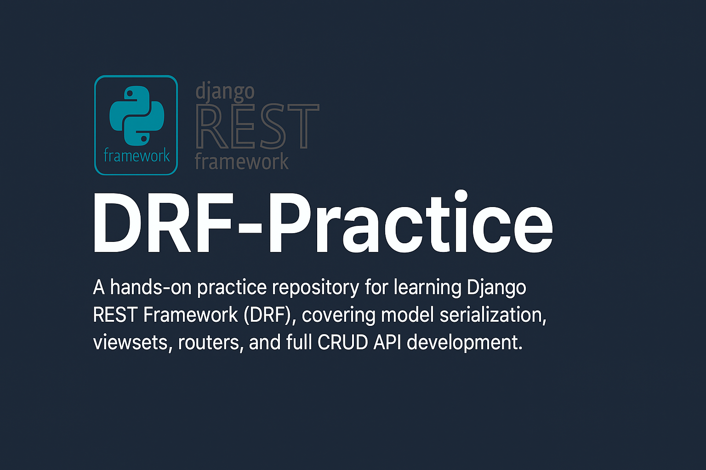

<h1 align="center">DRF-Practice</h1>

This repository contains practice projects and examples built using **Django REST Framework (DRF)**. The goal is to get hands-on experience with building *RESTful APIs* using Django's robust tools and authentication systems.

## 🚀 Features Implemented

- Model definition using Django ORM
- Serializer creation with `HyperlinkedModelSerializer`
- ViewSet implementation with `ModelViewSet`
- URL routing using DRF's `DefaultRouter`
- Browsable API interface
- API authentication using:
  - Session login/logout
  - Token authentication (via `dj-rest-auth`)
  - User registration & email verification (via `django-allauth`)

## 🛠 Tech Stack

- Python 3
- Django 4.x
- Django REST Framework
- dj-rest-auth
- django-allauth
- SQLite (default DB)

## 📂 Project Structure

```

DRF-Practice/
├── apis/
│   ├── models.py              # GeeksModel definition
│   ├── serializers.py         # GeeksSerializer using HyperlinkedModelSerializer
│   ├── views.py               # GeeksViewSet for full CRUD API
│   └── urls.py                # DRF router and URL configuration
├── drf/
│   └── urls.py                # Includes API URLs and auth/registration routes
├── requirements.txt           # Project dependencies
└── manage.py

```

## ⚙️ How to Run Locally

1. **Clone the repo**
   ```
   git clone https://github.com/RR0327/DRF-Practice.git
   cd DRF-Practice
   ```

2. **Create and activate a virtual environment**

   ```
   python -m venv venv
   venv\Scripts\activate   # On Windows
   # or
   source venv/bin/activate  # On macOS/Linux
   ```

3. **Install dependencies**

   ```
   pip install -r requirements.txt
   ```

4. **Run migrations**

   ```
   python manage.py makemigrations
   python manage.py migrate
   ```

5. **Create a superuser**

   ```
   python manage.py createsuperuser
   ```

6. **Run the development server**

   ```
   python manage.py runserver
   ```

## 🔐 Authentication Routes

| Endpoint                        | Method | Description                           |
| ------------------------------- | ------ | ------------------------------------- |
| `/auth/login/`                  | POST   | Log in with username/email & password |
| `/auth/logout/`                 | POST   | Log out the current user              |
| `/auth/registration/`           | POST   | Register a new user                   |
| `/auth/user/`                   | GET    | Get currently logged-in user          |
| `/auth/password/reset/`         | POST   | Request password reset email          |
| `/auth/password/reset/confirm/` | POST   | Confirm password reset                |
| `/auth/email/verify/`           | POST   | Trigger email verification            |

> 💡 Email functionality requires email backend setup in `settings.py`.

## 📌 CRUD Endpoints for Geeks Model

| Method | Endpoint       | Description            |
| ------ | -------------- | ---------------------- |
| GET    | `/geeks/`      | List all entries       |
| POST   | `/geeks/`      | Create new entry       |
| GET    | `/geeks/<id>/` | Retrieve specific item |
| PUT    | `/geeks/<id>/` | Update specific item   |
| DELETE | `/geeks/<id>/` | Delete specific item   |

## 🙋‍♂️ About Me

Md Rakibul Hassan

CSE Undergraduate | Backend Developer | Robotics & IoT Enthusiast

🔗 [LinkedIn](https://www.linkedin.com/in/md-rakibul-hassan-507b00308)

🐙 [GitHub](https://github.com/RR0327)

---

This is a growing repository for exploring Django REST Framework — feel free to fork, clone, and experiment!

---
